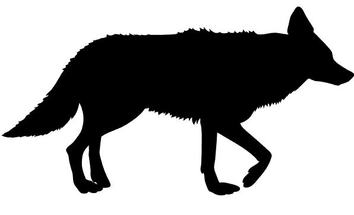

# A repository for:

### River, K, Fidino, M, Farris, ZJ, Murphy, A, Magle, SB, and Gerber, BD. Rethinking habitat occupancy modeling and the role of diel activity in an anthropogenic world. In Review.
---

## Links to different parts of the readme file

1. [What's in this repository?](#whats-in-this-repository)
2. [What does this model do?](#what-does-this-model-do)
3. [The working directory](#the-working-directory)
4. [Workflows in this repository](#workflows-in-this-repository)
	1. [Data processing workflow](#data-processing-workflow)
	2. [Simulation workflow](#simulation-workflow)
	3. [RNP Fosa modeling workflow](#rnp-fosa-modeling-workflow)
	4. [Makira Fosa modeling workflow](#makira-fosa-modeling-workflow)
	5. [Plotting Fosa results workflow](#plotting-fosa-results-workflow)

## What's in this repository?

This repository stores all of the data and code used to fit the various parameterizations of the static and dynamic MSDOMs that we used in the assoicated manuscript. We demonstrated the static MSDOM with a Madagascar fosa case study, while the dynamic MSDOM is applied to a Chicago coyote case study. 

In addition to the code to recreate our analysis, we've inclued a number of other helpful scripts. This includes a script that demonstrates how the MSDOM is equivalent to other multistate occupancy models used to estimate species cooccurrence, scripts for simulating MSDOM data and fitting them, and an example of how to discretize date/time data from a cameratrap dataset to fit an MSDOM. These latter scripts are not especially part of the associated manuscript itself, but they are just some additional files we put together to hopefully make this model easier to understand and use.

This document here serves as a road map that describes the workflows for recreating our analyses and provides information of the files present in this repository.

[Back to table of contents ⤒](#a-repository-for)

## What does this model do?

This is a multistate occupancy model that discretizes diel time into disctinct categories so that variation in a species spatial use of different temporal categories can be evaluated over environmental gradients. 

While the application of this class of model to diel categories is novel, the model itself is not "new." In fact, the static MSDOM is a slightly different parameterization of [Rota et al. (2016)](https://doi.org/10.1111/2041-210X.12587) that uses the Categorical distribution instead of the multivariate Bernoulli distribution. The dynamic MSDOM is an expansion of [Fidino et al. (2018)](https://doi.org/10.1111/2041-210X.13117).

If you are interested in a very top-level introduction to this model, we presented on it in 2021 at a couple of different conferences. [Follow this link here](https://www.youtube.com/watch?v=r1ZMLwPQAkM) for a 15 minute presentation by Mason Fidino that is hosted on YouTube.

[Back to table of contents ⤒](#a-repository-for)

### The working directory

For all scripts in this repository, we assume you have set the working directory as the folder that houses the entire repository. All files that are read in or scripts that are run are made relative to this central directory.

Overall, this repository contains 6 subfolders:

1) The **Chicago coyote** folder includes data, R scripts, and plots specific to case study on coyotes that uses the dynamic MSDOM.
2) The **Data Procesing** folder includes R scripts and example data on how to prepare data for the MSDOM.
3) The **JAGS** folder includes JAGS models for the static and dynamic MSDOM, including the full, reduced, and null parameterizations.
4) The **Makira Fosa2** folder includes fosa data from Makira Natural Park and R scripts for fitting the static MSDOM, including model comparison using CPO.
5) The **RNP Fosa** folder includes fosa data from Ranomafana National Park and R scripts for fitting the MSDOM, including model comparison using CPO.
6) The **Simulation Files** folder includes scripts for simulating data under different versions of the static and dynamic MSDOM (full, reduced, null) and fitting these models using JAGS.

[Back to table of contents ⤒](#a-repository-for)

### Workflows in this repository

As there are multiple analyses, there are multiple workflows in this repository. We describe each of them here, and then leave the more specific file explanations to later in this README file.

#### Data processing workflow

The data processing is simply meant as an example, but because it is important to know how to process the data before modeling we thought it was a good idea to demonstrate this. Within `./Data processing/`, the script `Diel.Occ.Script.R` is provided as an exemplar on how to convert single-state occupancy detection matrices to a 4 state matrix to be used in the MSDOM. This script uses the function script `diel.occ.fun.R` (**WHICH IS LOCATED WHERE**).

[Back to table of contents ⤒](#a-repository-for)

#### Simulation workflow

##### Static model simulations (`./Simulation Files/`)

Simulating and fitting data from a model is perhaps the best way to understand how the model works. There are no simulations in the manuscript. These are provided for folks interested in exploring the workings of the MSDOM.
To start, choose whether you want to simulate the Null, Reduced, or Full MSDOM. The respective simulations files are `sim.data.MSDOM.null.model.r`, `sim.data.MSDOM.reduced.model.r`, and `sim.data.MSDOM.full.model.r`.

The simulation scripts are setup to simulate a default of 100 datasets from the chosen model and output a model object, for example, `sim.full.data`.
Once data is simulated, use the script `fit.sim.data.MSDOM.r` to fit models to each data set. The script is setup to fit the Null, Reduced, and Full MSDOMs. Results are automatically output into sequential files, e.g., `fit.simdata.Full.1.out`.
Model comparison using CPO can be done for each of the three models on each data set using the script `model.comparison.CPO.r`.

##### Dynamic model simulations  (`./Simulation Files/dynamic_simulations`)

The dynamic model simualtions have been set up so that all you need to do is source the respective R script of the different dynamic MSDOM parameterizations. As written, these scripts will simulate the data, fit the model, and then compare the parameter estimates to the true values that generated the data in a plot. We have provided four different parameterizations of the dynamic MSDOM for simulation. For each of these scripts, you can either open it up and run through it on your own, or just source the script relative to the working directory.

- `dynamic_conditional.R`: For the full MSDOM that includes second-order parameters. Example of use: `source("./Simulation Files/dynamic_simulation/dynamic_conditional.R")`.

- `dynamic_conditional_indep.rho.R`: Identical to `dynamic_conditional.R` except the detection states are assumed to be independent. Example of use: `source("./Simulation Files/dynamic_simulation/dynamic_conditional_indep_rho.R")`.

- `dynamic_null.R`: This is still a MSDOM, except there are no second-order parameters in the model. Example of use: `source("./Simulation Files/dynamic_simulation/dynamic_null.R")`

- `dynamic_null_indep_rho.R`: Identical to `dynamic_null.R` except the detection states are assumed to be independent.  Example of use: `source("./Simulation Files/dynamic_simulation/dynamic_null_indep_rho.R")`.

All four of these scripts rely on `./Simulation Files/dynamic_simulation/dynamic_utilities.R`, which is a bunch of helper functions to simulate the data, store the true parameter values, prepare the data for the analysis, and compare the estimated results to the true values. Currently, these scripts are set up to randomly generate parameter values. If you wanted to input your own, you would have to generalize `sim_covariates()` in `dynamic_utilities.R` to accept the parameter values.

[Back to table of contents ⤒](#a-repository-for)

#### RNP Fosa modeling workflow

There are two scripts that model fosa data from Ranomafana National Park used in the manuscript (both of which can be found in `./RNP Fosa/`), `RNP.MSDOM.modeling.script.r` and `RNP.MSDOM.modeling.script2.r`. The difference between the scripts is that `RNP.MSDOM.modeling.script2.r` includes a categorical covariate to indicate the survey each of the data come from, 2007 or 2008. Each script fits 9 models, in which covariates are used or not and the model specification is either Full, Null, or Reduced.  For each model fit, CPO is estimated and appended to the file `CPO.out.RNP.csv`.

After a model or models are fit, the `RNP.GOF.r` file can be used to derive a Bayesian p-value for goodness of fit.
A plotting script, `RNP.MSDOM.plotting.r`, is provided to explore estimated parameters and predict occupancy probability using a supported covariate.

[Back to table of contents ⤒](#a-repository-for)

#### Makira Fosa modeling workflow

The Makira fosa models are fit in `./Makira Fosa2/`. The script `makira.data.script.r` compiles detection non-detection data across sampled to sites into a single R object (`Makira.data2`) that can be used in fitting MSDOMs.
MSDOMs are fit using the script `makira.modeling.script.r`. There are 6 models fit, with and without a covariate, for each of the Full, Reduced, and Null model specifications. These results are used in the manuscript. Each model object is saved within the `./Makira Fosa2` folder and the CPO value is appended to the file, `CPO.out.Makira.csv`.
The results from model outputs can be viewed using the `makira.MSTOM.plotting.r` script.

[Back to table of contents ⤒](#a-repository-for)

#### Plotting Fosa results workflow

These figures are generated within the working directory with the file `Fosa_Plots_Final.R.` This script assumes you have ran through both the RNP Fosa and Makira Fosa modeling workflows, and have saved the model output objects (which are used to plot these results).

---

 <h3>Chicago coyote</h3> 

If you are interested in fitting the suite of dynamic MSDOMs we did to the coyote
data, then all you need to run is `./Chicago coyote/fit_models.R`.

### Sub-folders

**data** - Folder of coyote data files

**figures** - Folder of dynamic MSDOM results using coyote data

**mcmc_plots** - Folder of MCMC traceplots of model parameters

**pngs** - Folder of icons used in figures

### Scripts

**analysis_utilities.R** - A contains the function `make_model_matrix`, which
is used to make the design matrix for the dynamic MSDOMs across the three models
fit to the coyote data, which makes it possible to fit all the models in a for
loop within `./Chicago coyote/fit_models.R`.

**calculate_steady_state.R** - estimating steady state occupancy from a transition matrix, used after a model has been fit.

**extract_covariates.R** - extracting site-level urbanization covariates. This
script requires you to have the associated raster or shape files downloaded on
your local computer (the script outlines where we downloaded them from).

**fit_models.R** - fits the dynamic MSDOM models to the coyote data. Assumes that 
the repository is the current working directory.

**model_selection.R** - model comparison via CPO, ran after models are fit.

**plot_tpm.R** - evaluating the best fit-model to make figures

**plot_utilities.R** - model output processing for plotting

**prep_objects_for_model.R** - Sourced by fit_models.R and model_selection.R scripts more clear. This script essentially prepares all of the data for analysis. Definitely
something to look through if you are running `./Chicago coyote/fit_models.R` as 
a number of objects are created in here that are used (e.g., a `models` data.frame 
with formulas that specify the models being fit).

**scrub_coyote_data.R** - arrange detection non-detction with observed diel states. This is a good example of how you would prepare your raw camera trap data for analysis with an MSDOM (for the four state model we used).

**spatial_utilities.R** - This contains a suite of functions to extract covariate
data. It's an older working version of https://github.com/mfidino/uwinspatialtools.

**summarise_parameters.R** - processing model fit output. We used this to get
expected parameter estimates for the results section and put them into a 
transition probability matrix (to make is easier to look at).

---

 <h3>Data Processing</h3> 

This folder is for the static MSDOM case studies.

**Example_Detection_Matrix.csv** - single state detection/non-detection matrix

**Example_Photo_Data.csv** - original photo data relevant to the example detection matrix

**diel.occ.fun.R** - the function called by Diel.Occ.Script.R

**Diel.Occ.Script.R** - script to convert a single-state occupancy detection matrix into a 4 state diel matrix

---

<h2>JAGS folder</h2>

<h3>Dynamic MSDOMs</h3> 

Note: These dynamic models have been written in a way to work with the output
from the make_model_matrix function used in `./Chicago coyote/fit_models.R`.  

**jags.dynamic.fake.multistate.R** - standard dynamic occupancy model generalized to be fit with multi-state data

**jags.dynamic.multistate.covars.R** - dynamic MSDOM with second-order
parameters and covariates.

**jags.dynamic.multistate.null.R** - dynamic MSDOM parameterized without second-order parameters

 <h3>Static MSDOM</h3> 

 <h4>FULL Model</h3> 

**jags.multistate.occ.full.R** - Full MSDOM with probabilities estimated directly (no logit transformation) without site covariates.

**jags.multistate.occ.full.alt.R**- Full MSDOM with probabilities estimated on the logit scale without site covariates. 

**jags.multistate.occ.full.alt.RE.R** - Full MSDOM with probabilities estimated on the logit scale; detection and occupancy parameters are realizations from a higher order Normal distribution (i.e. random effect). No covariates.

**jags.multistate.occ.full.site.covs.by.state.R** - Full MSDOM with probabilities estimated on the logit scale, in which occupancy parameters are modeled using any set or size of site covariates, separately for each state.

**jags.multistate.occ.full.site.covs.R** - Full MSDOM with probabilities estimated on the logit scale, in which occupancy parameters are modeled using the same single site covariate, separately for each state.

**jags.multistate.occ.full.site.covs.RE.R** - Full MSDOM with probabilities estimated on the logit scale, in which occupancy parameters are modeled using separate covariates for each state and detection and occupancy parameters are realizations from a higher order Normal distribution (i.e. random effect).   

 <h4>REDUCED</h3> 

**jags.multistate.occ.reduced.R** - Reduced MSDOM with probabilities estimated directly (no transformation).

**jags.multistate.occ.reduced.alt.R** - Reduced MSDOM with occupancy probabilities estimated directly and detection probabilities estimated on the logit scale.

**jags.multistate.occ.red.det.full.R** - Reduced MSDOM with a reduced state occupancy parameterization (no transformation) and full state detection probability parameterization (no transformation).

**jags.multistate.occ.reduced.site.covs.R** - Reduced MSDOM in which logit-scaled occupancy parameters are modeled using the same single site covariate and state detection probabilities are reduced (no transformation).

**jags.multistate.occ.reduced.alt.RE.R** - Reduced MSDOM in which all parameters are estimated on the logit scale and state and detection proabilities are realizations from separate higher order Normal distributions (i.e. random effect).   

**jags.multistate.occ.reduced.site.covs.RE.R** - Reduced MSDOM in which all parameters are estimated on the logit scale and state occupancy parameters are modeled using separate (single) site covariates; detection and occupancy parameters are realizations from separate higher order Normal distributions (i.e. random effect).   

**jags.multistate.occ.reduced.site.covs.by.state.R**- Reduced MSDOM in which all parameters are estimated on the logit scale and state occupancy parameters are modeled using any set and any number of separate site covariates.

 <h4>NULL</h3> 

**jags.multistate.occ.null.R** - Null MSDOM, in which there is no state variation in occupancy or detection parameters; parameters are estimated directly (no transformation).

**jags.multistate.occ.null.alt.R** - Null MSDOM, in which there is no state variation in occupancy or detection parameters; parameters are estimated on the logit scale.

**jags.multistate.occ.null.det.null.R** - Null MSDOM, in which there is no state variation in occupancy or detection parameters; occupancy parameters are estimated on the logit scale and detection parameters are estiamted without transformation.

**jags.multistate.occ.null.alt.RE.R** - Null MSDOM, in which there is no state variation in occupancy or detection parameters; detection and occupancy parameters are realizations from separate higher order Normal distributions (i.e. random effect).   

**jags.multistate.occ.null.site.covs.R** - Null MSDOM, in which there is no state variation in occupancy or detection parameters; occupancy parameters are modeled on the logit scale using the same site-covariate and detection parameters are estimated on the logit scale without covariates.   

**jags.multistate.occ.null.site.covs.by.state.R** - Null MSDOM, in which there is no state variation in occupancy or detection parameters; occupancy parameters are modeled on the logit scale using any set of the same site-covariates and detection parameters are estimated on the logit scale without covariates. 

**jags.multistate.occ.null.site.covs.RE.R** - Null MSDOM, in which there is no state variation in occupancy or detection parameters; occupancy parameters are modeled on the logit scale using any set of the same site-covariates and detection parameters are estimated on the logit scale without covariates. Detection and occupancy parameters are realizations from separate higher order Normal distributions (i.e. random effect)

---

 <h3>Makira Fosa2</h3> 

**AJB-FRK-LKT-MGB-SLJ-SOA-VIN** - Each folder contains site-level diel detection/non-detection data (4 states) and covariate information for the fosa

**makira.data.script.r** - data script to prepare detection data in a format useable for MSDOM model fitting

**Makira.data2** - R object containing the prepared data for model fitting

**Makira.fosa.det.parms.png** - posterior estimates of detection probabilites from the most supported model

**Makira.fosa.occ.parms.png** - posterior estimates of occupancy probabilites from the most supported model

**makira.modeling.script.r** - static MSDOM model fitting to Makira fosa data

**makira.MSTOM.plotting.r** - basic plotting from model output

**multi.state.likelihood.r** - MSDOM likelihood for 4 states used to compare models

**CPO.function.RE.r** - MSDOM likelihood for 4 states used to compare models

**CPO.out.Makira.csv** - script to calculate CPO from a model with random effects on occupancy and detection parameters

---

 <h3>RNP Fosa</h3> 

**CPO.function.r** - model comparison script

**CPO.out.RNP.csv** - results of model comparison using CPO

**GOF.r** - posterior predictive check function

**M1.full.fit** - R object of most supported model used for plotting

**RNP.GOF.r** - script to process posterior predictive check

**RNP.MSDOM.modeling.script.r** - fosa RNP model fitting without an effect for survey

**RNP.MSDOM.modeling.script2.r** - fosa RNP model fitting of the same models but with a categorical effect for survey. 

**RNP.MSTOM.plotting.r** - basic plotting of model object

**RNP.fosa.State.Prob.png** - predicted state probabilities varying by distance to nearest village

**RNP.fosa.det.parms.png** - posterior distributions of detection parameters from the most supported model

**RNP.fosa.parms.png** - posterior distributions of occupancy parameters from the most supported model

**RNP2.data** - R object of fosa RNP data

**RNP2007.csv** - prepared 4-state detection/non-detection data of fosa from RNP

**multi.state.likelihood.r** - MSDOM likelihood function to be used for model comparison 

---

 <h3>Simulation Files</h3> 

**dynamic_simulations** - Folder for simulating dynamic MSDOM data. There are four simulation scripts, which can be used to fit the full dynamic MSDOM (with or without
independent detection parameters for the fourth state), as well as the dynamic model
without second order parameters. The final script in here `dynamic_utilities.R`, has
a lot of functions that were written to streamline the simulations, and has some 
functions that are even used in `./Chicago coyote/fit_models.R`.

**MARK.2.species** - Folder containing output results from MARK model fitting using the unconditional 2 species occupancy model

**det.matrix.func.r** - function to put detection parameters into a matrix

**fit.sim.data.MSDOM.r** - fits simulated MSDOM data using JAGS models

**model.comparison.CPO.r** - compares models via CPO

**MSDOM Full comparison with 2.species.occ.model.r** - comparison of the original unconditional two species occupancy model with that of the MSDOM Full model

**MSDOM Full comparison with 2.species.occ.model2.R** - comparison of the conditional two species occupancy model with that of the MSDOM Full model

**multi.state.likelihood.r** - likelihood function for the 4 state MSDOM

**null.model.comparison.r** - compares the null model MSDOM estimates of overall occupancy with estimates of occupancy from simple occupancy model without state designations

**sim.data.MSDOM.full.model.r** - script to simulate data from the full MSDOM

**sim.data.MSDOM.null.model.r** - script to simulate data from the null MSDOM

**sim.data.MSDOM.reduced.model.r** - script to simulate data from the reduced MSDOM

**sim.full.data** - R object of simulated data from the full MSDOM

**sim.null.data** - R object of simulated data from the null MSDOM

**sim.reduced.data** - R object of simulated data from the reduced MSDOM

---
