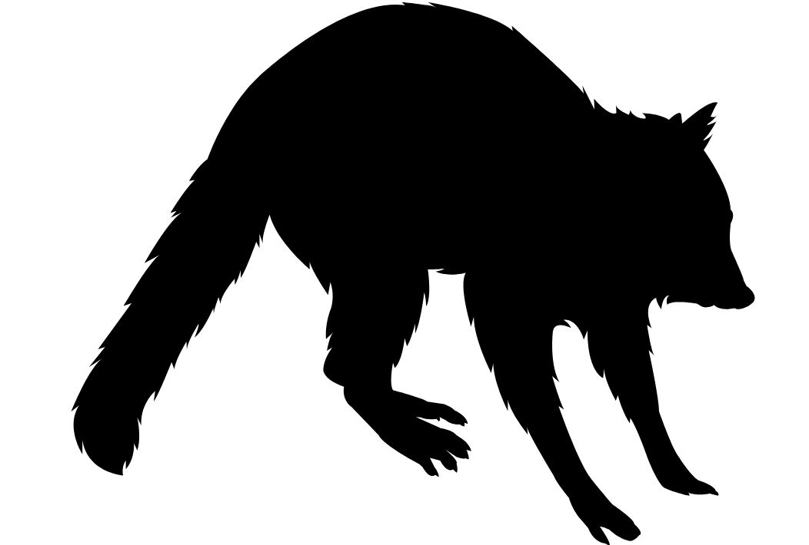

# **A repository for the multi-state diel occupancy model (MSDOM):** 

### River, K, Fidino, M, Farris, ZJ, Murphy, A, Magle, SB, and Gerber, BD. Rethinking habitat occupancy modeling and the role of diel activity in an anthropogenic world. In Review.
---

**This repository includes 6 subfolders: Chicago coyote, Data Processing, JAGS, Makira Fosa2, RNP Fosa, and Simulation Files.**
1) The **Chicago coyote** folder includes data, R scripts, and plots specific to case study on coyotes that uses the dynamic MSDOM.
2) The **Data Procesing** folder includes R scripts and example data on how to prepare data for the MSDOM.
3) The **JAGS** folder includes JAGS models for the static and dynamic MSDOM, including the full, reduced, and null parameterizations.
4) The **Makira Fosa2** folder includes fosa data from Makira Natural Park and R scripts for fitting the static MSDOM, including model comparison using CPO.
5) The **RNP Fosa** folder includes fosa data from Ranomafana National Park and R scripts for fitting the MSDOM, including model comparison using CPO.
6) The **Simulation Files** folder includes scripts for simulating data under different versions of the MSDOM (full, reduced, null) and fitting these models using JAGS.

---

 <h3>Chicago coyote</h3> 

**data** - Folder of coyote data files

**figures** - Folder of dynamic MSDOM results using coyote data

**lasso_output** - Folder of R data file of model object output

**mcmc_plots** - Folder of MCMC traceplots of model parameters

**pngs** - Folder of icons

**analysis_utilities.R** - make_model_matrix function

**calculate_steady_state.R** - estimating steady state occupancy from a transition matrix

**dynamic_occupancy_as _fake_multistate.R** - checking how to make a multi-state dynamic occupancy model parameterization without states

**extract_covariates.R** - extracting site-level urbanization covariates

**fit_lasso_models.R** - fitting dynamic MSDOM models with penalizatoin

**fit_models.R** - fitting dynamic MSDOM models

**model_selection.R** - model comparison via CPO

**plot_tpm.R** - evaluating the best fit-model to make figures

**plot_utilities.R** - model output processing

**prep_objects_for_model.R** - to make the fit_models.R and model_selection.R scripts more clear

**scrub_coyote_data.R** - arrange detection non-detction with obseried diel states

**spatial_utilities.R** - spatial data processing script

**summarise_parameters.R** - processing model fit output

---

 <h3>Data Processing</h3> 

**Example_Detection_Matrix.csv** - single state detection/non-detection matrix

**Example_Photo_Data.csv** - original photo data relevant to the example detection matrix

**diel.occ.fun.R** - the function called by Diel.Occ.Script.R

**Diel.Occ.Script.R** - script to convert a single-state occupancy detection matrix into a 4 state diel matrix

---

<h2>JAGS folder</h2>

<h3>Dynamic MSDOM</h3> 

**jags.dynamic.fake.multistate.R** - standard dynamic occupancy model generalized to be fit with multi-state data

**jags.dynamic.multistate.covars.lasso.R** - dynamic MSDOM with covariates and hierarchical lasso penalization

**jags.dynamic.multistate.covars.R** - dynamic MSDOM with covariates

**jags.dynamic.multistate.null.R** - dynamic MSDOM parameterized without states

**temporal_multi_varying_covars.R** - dynamic MSDOM with covariates varying by primary periods

**null_temporal_multi_varying_covars.R** - dynamic MSDOM with covariates varying by primary periods and without states

 <h3>Static MSDOM</h3> 

 <h4>FULL Model</h3> 

**jags.multistate.occ.full.R** - Full MSDOM with probabilities estimated directly (no logit transformation) without site covariates.

**jags.multistate.occ.full.alt.R**- Full MSDOM with probabilities estimated on the logit scale without site covariates. 

**jags.multistate.occ.full.alt.RE.R** - Full MSDOM with probabilities estimated on the logit scale; detection and occupancy parameters are realizations from a higher order Normal distribution (i.e. random effect). No covariates.

**jags.multistate.occ.full.site.covs.by.state.R** - Full MSDOM with probabilities estimated on the logit scale, in which occupancy parameters are modeled using any set or size of site covariates, separately for each state.

**jags.multistate.occ.full.site.covs.R** - Full MSDOM with probabilities estimated on the logit scale, in which occupancy parameters are modeled using the same single site covariate, separately for each state.

**jags.multistate.occ.full.site.covs.RE.R** - Full MSDOM with probabilities estimated on the logit scale, in which occupancy parameters are modeled using separate covariates for each state and detection and occupancy parameters are realizations from a higher order Normal distribution (i.e. random effect).   

 <h4>REDUCED</h3> 

**jags.multistate.occ.reduced.R** - Reduced MSDOM with probabilities estimated directly (no transformation).

**jags.multistate.occ.reduced.alt.R** - Reduced MSDOM with occupancy probabilities estimated directly and detection probabilities estimated on the logit scale.

**jags.multistate.occ.red.det.full.R** - Reduced MSDOM with a reduced state occupancy parameterization (no transformation) and full state detection probability parameterization (no transformation).

**jags.multistate.occ.reduced.site.covs.R** - Reduced MSDOM in which logit-scaled occupancy parameters are modeled using the same single site covariate and state detection probabilities are reduced (no transformation).

**jags.multistate.occ.reduced.alt.RE.R** - Reduced MSDOM in which all parameters are estimated on the logit scale and state and detection proabilities are realizations from separate higher order Normal distributions (i.e. random effect).   

**jags.multistate.occ.reduced.site.covs.RE.R** - Reduced MSDOM in which all parameters are estimated on the logit scale and state occupancy parameters are modeled using separate (single) site covariates; detection and occupancy parameters are realizations from separate higher order Normal distributions (i.e. random effect).   

**jags.multistate.occ.reduced.site.covs.by.state.R**- Reduced MSDOM in which all parameters are estimated on the logit scale and state occupancy parameters are modeled using any set and any number of separate site covariates.

 <h4>NULL</h3> 

**jags.multistate.occ.null.R** - Null MSDOM, in which there is no state variation in occupancy or detection parameters; parameters are estimated directly (no transformation).

**jags.multistate.occ.null.alt.R** - Null MSDOM, in which there is no state variation in occupancy or detection parameters; parameters are estimated on the logit scale.

**jags.multistate.occ.null.det.null.R** - Null MSDOM, in which there is no state variation in occupancy or detection parameters; occupancy parameters are estimated on the logit scale and detection parameters are estiamted without transformation.

**jags.multistate.occ.null.alt.RE.R** - Null MSDOM, in which there is no state variation in occupancy or detection parameters; detection and occupancy parameters are realizations from separate higher order Normal distributions (i.e. random effect).   

**jags.multistate.occ.null.site.covs.R** - Null MSDOM, in which there is no state variation in occupancy or detection parameters; occupancy parameters are modeled on the logit scale using the same site-covariate and detection parameters are estimated on the logit scale without covariates.   

**jags.multistate.occ.null.site.covs.by.state.R** - Null MSDOM, in which there is no state variation in occupancy or detection parameters; occupancy parameters are modeled on the logit scale using any set of the same site-covariates and detection parameters are estimated on the logit scale without covariates. 

**jags.multistate.occ.null.site.covs.RE.R** - Null MSDOM, in which there is no state variation in occupancy or detection parameters; occupancy parameters are modeled on the logit scale using any set of the same site-covariates and detection parameters are estimated on the logit scale without covariates. Detection and occupancy parameters are realizations from separate higher order Normal distributions (i.e. random effect)

---

 <h3>Makira Fosa2</h3> 

**AJB-FRK-LKT-MGB-SLJ-SOA-VIN** - Each folder contains site-level diel detection/non-detection data (4 states) and covariate information for the fosa

**makira.data.script.r** - data script to prepare detection data in a format useable for MSDOM model fitting

**Makira.data2** - R object containing the prepared data for model fitting

**Makira.fosa.det.parms.png** - posterior estimates of detection probabilites from the most supported model

**Makira.fosa.occ.parms.png** - posterior estimates of occupancy probabilites from the most supported model

**makira.modeling.script.r** - static MSDOM model fitting to Makira fosa data

**makira.MSTOM.plotting.r** - basic plotting from model output

**multi.state.likelihood.r** - MSDOM likelihood for 4 states used to compare models

**CPO.function.RE.r** - MSDOM likelihood for 4 states used to compare models

**CPO.out.Makira.csv** - script to calculate CPO from a model with random effects on occupancy and detection parameters

---

 <h3>RNP Fosa</h3> 

**CPO.function.r** - model comparison script

**CPO.out.RNP.csv** - results of model comparison using CPO

**GOF.r** - posterior predictive check function

**M1.full.fit** - R object of most supported model used for plotting

**RNP.GOF.r** - script to process posterior predictive check

**RNP.MSDOM.modeling.script.r** - fosa RNP model fitting without an effect for survey

**RNP.MSDOM.modeling.script2.r** - fosa RNP model fitting of the same models but with a categorical effect for survey. 

**RNP.MSTOM.plotting.r** - basic plotting of model object

**RNP.fosa.State.Prob.png** - predicted state probabilities varying by distance to nearest village

**RNP.fosa.det.parms.png** - posterior distributions of detection parameters from the most supported model

**RNP.fosa.parms.png** - posterior distributions of occupancy parameters from the most supported model

**RNP2.data** - R object of fosa RNP data

**RNP2007.csv** - prepared 4-state detection/non-detection data of fosa from RNP

**multi.state.likelihood.r** - MSDOM likelihood function to be used for model comparison 

---

 <h3>Simulation Files</h3> 

**dynamic_simulations** - Folder for simulating dynamic MSDOM data

**MARK.2.species** - Folder containing output results from MARK model fitting using the unconditional 2 species occupancy model

**det.matrix.func.r** - function to put detection parameters into a matrix

**fit.sim.data.MSDOM.r** - fits simulated MSDOM data using JAGS models

**model.comparison.CPO.r** - compares models via CPO

**MSDOM Full comparison with 2.species.occ.model.r** - comparison of the original unconditional two species occupancy model with that of the MSDOM Full model

**MSDOM Full comparison with 2.species.occ.model2.R** - comparison of the conditional two species occupancy model with that of the MSDOM Full model

**multi.state.likelihood.r** - likelihood function for the 4 state MSDOM

**null.model.comparison.r** - compares the null model MSDOM estimates of overall occupancy with estimates of occupancy from simple occupancy model without state designations

**sim.data.MSDOM.full.model.r** - script to simulate data from the full MSDOM

**sim.data.MSDOM.null.model.r** - script to simulate data from the null MSDOM

**sim.data.MSDOM.reduced.model.r** - script to simulate data from the reduced MSDOM

**sim.full.data** - R object of simulated data from the full MSDOM

**sim.null.data** - R object of simulated data from the null MSDOM

**sim.reduced.data** - R object of simulated data from the reduced MSDOM

---